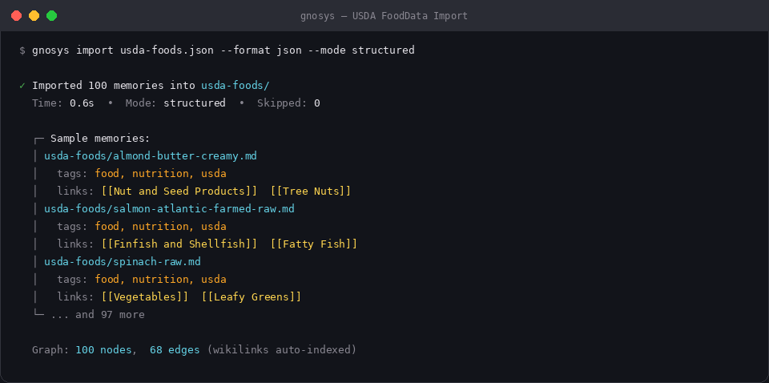
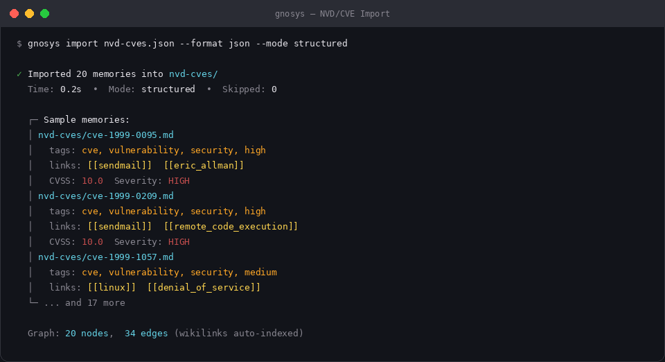

<p align="center">
  
</p>

<p align="center">
  <a href="https://www.npmjs.com/package/gnosys-mcp"></a>
  <a href="https://github.com/proticom/gnosys-mcp/actions"></a>
  <a href="https://gnosys.ai"></a>
  <a href="https://github.com/proticom/gnosys-mcp/blob/master/LICENSE"></a>
</p>

---

### Gnosys — Persistent Memory for AI Agents (and Universal Transparent Knowledge Engine)

**Gnosys** gives LLMs — and humans — a knowledge layer that survives across sessions and scales to real-world datasets.

Every piece of knowledge is stored as an atomic Markdown file with rich YAML frontmatter inside a `.gnosys/` directory. Git versions every change. SQLite FTS5 delivers instant keyword search. The entire folder is a fully functional Obsidian vault for browsing, wikilinking, graphing, and editing.

It runs as a CLI and a complete MCP server that drops straight into Cursor, Claude Desktop, Claude Code, or any MCP client.

**Beyond agents**: Gnosys turns any structured dataset into a connected, versioned knowledge graph.
• NVD/CVE Database: 200k+ vulnerabilities auto-linked to packages, exploits, patches, and supersession history. Ask "which of our dependencies have active unpatched criticals?"
• USDA FoodData Central: ~8k foods atomized with wikilinks to nutrients and substitutions. Ask "high-protein, low-sodium, high-potassium alternatives to X?"

No vector DBs. No black boxes. No external services. Just files, Git, and Obsidian — the way knowledge should be.

---

## Why Gnosys?

Most "memory for LLMs" solutions use vector databases, embeddings, or proprietary services. They're opaque — you can't see what the model remembers, can't edit it, can't version it, can't share it.

Gnosys takes a different approach: every memory is a plain Markdown file with YAML frontmatter. The entire knowledge base is a Git repository and an Obsidian vault. You can read it, edit it, version it, grep it, and back it up with the tools you already use.

**What makes it different:**

- **Transparent** — every memory is a human-readable `.md` file. No embeddings, no binary blobs.
- **Freeform Ask** — ask natural-language questions and get synthesized answers with Obsidian wikilink citations from the entire vault.
- **Hybrid Search** — combines FTS5 keyword search with semantic embeddings via Reciprocal Rank Fusion (RRF).
- **Versioned** — Git auto-commits every write. Full history, rollback, and diff support.
- **Obsidian-native** — the `.gnosys/` folder is a real vault. Graph view, wikilinks, tags, backlinks — all work.
- **MCP-first** — drops into Cursor, Claude Desktop, Claude Code, Codex, or any MCP client with one config line.
- **Bulk import** — CSV, JSON, JSONL. Import entire datasets (USDA, NVD, your internal docs) in seconds.
- **Layered stores** — project, personal, global, and optional read-only stores stacked by precedence.
- **Zero infrastructure** — no databases, no Docker (unless you want it), no cloud services. Just `npm install`.

---

## Real-World Use Cases

### USDA FoodData Central — 100 foods imported in 0.6s



```bash
gnosys import usda-foods.json \
  --format json \
  --mapping '{"title":"title","category":"category","content":"content","tags":"tags","relevance":"relevance"}' \
  --mode structured --skip-existing
```

Each food becomes an atomic memory with nutrient data and `[[wikilinks]]` to food categories:

```yaml
---
title: "Almond butter, creamy"
category: usda-foods
tags:
  domain: [food, nutrition, usda]
relevance: "almond butter creamy food nutrition usda fdc nutrient diet dietary protein"
---
# Almond butter, creamy

**Food Category:** [[General]]

## Key Nutrients (per 100g)
- Protein (g): 20.4 G
- Total Fat (g): 55.7 G
- Calcium (mg): 264 MG
- Potassium (mg): 699 MG
```

### NVD/CVE Database — 20 vulnerabilities with CVSS scores and affected products



```bash
gnosys import nvd-cves.json \
  --format json \
  --mapping '{"title":"title","category":"category","content":"content","tags":"tags","relevance":"relevance"}' \
  --mode structured --skip-existing
```

Each CVE links to affected packages via wikilinks:

```yaml
---
title: CVE-1999-0095
tags:
  domain: [cve, vulnerability, security, high]
relevance: "cve-1999-0095 cve vulnerability security nvd patch exploit high eric_allman sendmail"
---
# CVE-1999-0095

The debug command in Sendmail is enabled, allowing attackers to execute commands as root.

**CVSS Score:** 10.0 (HIGH)
**Affected:** [[eric_allman/sendmail]]
```

See [DEMO.md](DEMO.md) for the full step-by-step walkthrough.

---

## Quick Start

```bash
# Install
npm install -g gnosys-mcp

# Initialize a store in your project
cd your-project
gnosys init

# Add a memory (uses LLM to structure it — needs ANTHROPIC_API_KEY)
gnosys add "We chose PostgreSQL over MySQL for its JSON support and mature ecosystem"

# Or add without an LLM
gnosys add-structured --title "Use PostgreSQL" --category decisions \
  --content "Chosen for JSON support and mature ecosystem" \
  --relevance "database postgres sql json storage"

# Find memories later
gnosys discover "database selection"

# Full-text search
gnosys search "PostgreSQL"
```

---

## Installation

### npm (recommended)

```bash
npm install -g gnosys-mcp
```

### Docker

```bash
# Build the image
docker build -t gnosys .

# Initialize a store
docker run -v $(pwd):/data gnosys init

# Import data
docker run -v $(pwd):/data gnosys import data.json --format json \
  --mapping '{"name":"title","type":"category","notes":"content"}' \
  --mode structured

# Start the MCP server
docker run -v $(pwd):/data gnosys serve
```

Or with Docker Compose:

```bash
# Start the MCP server (mounts current directory)
docker compose up

# Run any CLI command
docker compose run gnosys search "my query"
docker compose run gnosys import data.json --format json --mapping '...'
```

---

## MCP Server Setup

### Claude Desktop

Add to `~/Library/Application Support/Claude/claude_desktop_config.json`:

```json
{
  "mcpServers": {
    "gnosys": {
      "command": "npx",
      "args": ["gnosys-mcp"],
      "env": { "ANTHROPIC_API_KEY": "your-key-here" }
    }
  }
}
```

### Cursor

Add to `.cursor/mcp.json`:

```json
{
  "mcpServers": {
    "gnosys": {
      "command": "npx",
      "args": ["gnosys-mcp"],
      "env": { "ANTHROPIC_API_KEY": "your-key-here" }
    }
  }
}
```

### Claude Code

```bash
claude mcp add gnosys npx gnosys-mcp
```

### Codex

Add to `.codex/config.toml`:

```toml
[mcp.gnosys]
type = "local"
command = ["npx", "gnosys-mcp"]

[mcp.gnosys.env]
ANTHROPIC_API_KEY = "your-key-here"
```

### MCP Tools

| Tool | Description |
|------|-------------|
| `gnosys_discover` | Find relevant memories by keyword (start here) |
| `gnosys_read` | Read a specific memory |
| `gnosys_search` | Full-text search across stores |
| `gnosys_hybrid_search` | Hybrid keyword + semantic search (RRF fusion) |
| `gnosys_semantic_search` | Semantic similarity search (embeddings) |
| `gnosys_ask` | Ask a question, get a synthesized answer with citations |
| `gnosys_reindex` | Rebuild semantic embeddings from all memories |
| `gnosys_list` | List memories with optional filters |
| `gnosys_add` | Add a memory (LLM-structured) |
| `gnosys_add_structured` | Add with explicit fields (no LLM) |
| `gnosys_update` | Update frontmatter or content |
| `gnosys_reinforce` | Signal usefulness of a memory |
| `gnosys_commit_context` | Extract memories from conversation context |
| `gnosys_import` | Bulk import from CSV, JSON, or JSONL |
| `gnosys_init` | Initialize a new store |
| `gnosys_stores` | Show active stores |
| `gnosys_tags` | List tag registry |

---

## How It Works

A Gnosys store is a `.gnosys/` directory inside your project:

```
your-project/
  .gnosys/
    decisions/
      use-postgresql.md
    architecture/
      three-layer-design.md
    usda-foods/
      almond-butter-creamy.md
    nvd-cves/
      cve-2024-1234.md
    gnosys.json          # configuration
    .config/tags.json    # tag registry
    CHANGELOG.md
    .git/                # auto-versioned
```

Each memory is an atomic Markdown file with YAML frontmatter:

```yaml
---
id: deci-001
title: "Use PostgreSQL for Main Database"
category: decisions
tags:
  domain: [database, backend]
  type: [decision]
relevance: "database selection postgres sql json storage persistence"
author: human+ai
authority: declared
confidence: 0.9
created: 2026-03-01
status: active
supersedes: null
---
# Use PostgreSQL for Main Database

We chose PostgreSQL over MySQL and SQLite because...
```

Key fields:

- **relevance** — keyword cloud powering `discover`. Think: what would someone search to find this?
- **confidence** — 0–1 score. Observations: 0.6. Firm decisions: 0.9.
- **authority** — who established this? `declared`, `observed`, `imported`, `inferred`.
- **status** — `active`, `archived`, or `superseded`. Superseded memories link to replacements.

---

## Configuration

Gnosys reads `gnosys.json` from the `.gnosys/` directory. All fields are optional with sensible defaults:

```json
{
  "defaultLLMProvider": "anthropic",
  "defaultModel": "claude-haiku-4-5-20251001",
  "bulkIngestionBatchSize": 500,
  "importConcurrency": 5,
  "autoCommit": true,
  "llmRetryAttempts": 3,
  "llmRetryBaseDelayMs": 1000,
  "defaultAuthor": "ai",
  "defaultAuthority": "imported",
  "defaultConfidence": 0.8
}
```

A default `gnosys.json` is created during `gnosys init`. Validation is handled by Zod — invalid configs produce clear error messages.

---

## Using with Obsidian

The `.gnosys/` directory is a fully valid Obsidian vault. Open it and get graph view, wikilinks, backlinks, tag search, and visual editing with zero configuration.

1. Open Obsidian → "Open folder as vault" → select `.gnosys/`
2. Browse categories as folders, explore the graph view
3. Wikilinks between memories (e.g., `[[eric_allman/sendmail]]` in CVE data) create navigable connections
4. Edits made in Obsidian are picked up automatically (filesystem is source of truth)

---

## Bulk Import

Import any structured dataset into atomic memories:

```bash
# JSON with field mapping
gnosys import foods.json --format json \
  --mapping '{"description":"title","foodCategory":"category","notes":"content"}' \
  --mode structured

# CSV
gnosys import data.csv --format csv \
  --mapping '{"name":"title","type":"category","notes":"content"}'

# JSONL (one record per line)
gnosys import events.jsonl --format jsonl \
  --mapping '{"event":"title","type":"category","details":"content"}'

# With LLM enrichment (generates keyword clouds, better structure)
gnosys import data.json --mode llm --concurrency 3

# Preview without writing
gnosys import data.json --dry-run

# Resume interrupted imports
gnosys import data.json --skip-existing

# Slice a large dataset
gnosys import large.json --limit 500 --offset 1000
```

---

## Freeform Asking

Ask natural-language questions and get synthesized answers with citations from the entire vault. Gnosys retrieves relevant memories via hybrid search, then uses your LLM to synthesize a cited response.

```bash
# First, build the semantic index (downloads ~80 MB model on first run)
gnosys reindex

# Ask a question about your USDA data
gnosys ask "What are the best high-protein low-sodium food alternatives?"

# Ask about CVEs
gnosys ask "Which vulnerabilities allow remote code execution?"

# Use keyword-only mode (no embeddings needed)
gnosys ask "What do we know about cheddar cheese?" --mode keyword
```

Answers include Obsidian wikilink citations like `[[almond-butter-creamy.md]]` so you can click through to the source memories. If the initial search doesn't find enough context, a "deep query" follow-up search automatically expands the context.

### Hybrid Search

Three search modes available:

```bash
# Hybrid (default): combines keyword + semantic with RRF fusion
gnosys hybrid-search "high protein low sodium"

# Semantic only: finds conceptually related memories
gnosys semantic-search "healthy meal alternatives"

# Keyword only: classic FTS5 full-text search
gnosys hybrid-search "cheddar cheese protein" --mode keyword
```

The embedding model (`all-MiniLM-L6-v2`) is lazy-loaded — it's only downloaded the first time you run `gnosys reindex` or a semantic search. Embeddings are stored as a regeneratable sidecar in SQLite, never the source of truth.

---

## Layered Stores

Multiple stores stacked by precedence:

| Layer | Source | Writable | Use Case |
|-------|--------|----------|----------|
| **Project** | `.gnosys/` in project root | Yes (default) | Project-specific knowledge |
| **Optional** | `GNOSYS_STORES` env var | Read-only | Shared reference data |
| **Personal** | `GNOSYS_PERSONAL` env var | Yes (fallback) | Cross-project personal knowledge |
| **Global** | `GNOSYS_GLOBAL` env var | Explicit only | Org-wide shared knowledge |

```bash
export GNOSYS_PERSONAL="$HOME/.gnosys-personal"
export GNOSYS_GLOBAL="/shared/team/.gnosys"
export GNOSYS_STORES="/path/to/reference-data"
```

---

## Comparison

| Feature | **Gnosys** | NotebookLM | gnosis-mcp | Official MCP Memory |
|---------|-----------|------------|------------|-------------------|
| Storage | Markdown files + Git | Google proprietary | SQLite | JSON file |
| Transparent/editable | ✅ Plain `.md` files | ❌ Opaque | ❌ Binary DB | ✅ But flat JSON |
| Version history | ✅ Full Git history | ❌ | ❌ | ❌ |
| Obsidian vault | ✅ Native | ❌ | ❌ | ❌ |
| Bulk import | ✅ CSV/JSON/JSONL | ❌ Manual | ❌ | ❌ |
| MCP server | ✅ Native | ❌ | ✅ | ✅ |
| CLI | ✅ Full-featured | ❌ | ❌ | ❌ |
| Layered stores | ✅ 4 layers | ❌ | ❌ | ❌ |
| Wikilinks | ✅ Auto-generated | ❌ | ❌ | ❌ |
| Search | Hybrid: FTS5 + semantic + RRF | Proprietary | Basic SQL | None |
| Freeform Q&A | ✅ gnosys_ask with citations | ✅ Built-in | ❌ | ❌ |
| Self-hosted | ✅ | ❌ | ✅ | ✅ |
| LLM required | Optional (structured mode) | Required | No | No |
| Docker support | ✅ | ❌ | ❌ | ❌ |
| Price | Free / MIT | Free tier, then paid | Free | Free |

---

## CLI Reference

```bash
gnosys --help               # List all commands
gnosys init                  # Initialize a new store
gnosys add "raw input"       # Add memory via LLM
gnosys add-structured ...    # Add memory with explicit fields
gnosys discover "keywords"   # Find relevant memories (metadata only)
gnosys search "query"        # Full-text search with snippets
gnosys hybrid-search "q"     # Hybrid keyword + semantic search
gnosys semantic-search "q"   # Semantic similarity search
gnosys ask "question"        # Ask a question, get cited answer
gnosys reindex               # Build/rebuild semantic embeddings
gnosys read <path>           # Read a specific memory
gnosys list                  # List all memories
gnosys update <path> ...     # Update a memory
gnosys reinforce <id> ...    # Signal memory usefulness
gnosys stale                 # Find stale memories
gnosys commit-context "..."  # Extract memories from conversation
gnosys import <file> ...     # Bulk import data
gnosys tags                  # List tag registry
gnosys stores                # Show active stores
gnosys serve                 # Start MCP server (stdio)
```

---

## Development

```bash
npm install          # Install dependencies
npm run build        # Compile TypeScript
npm test             # Run test suite
npm run test:watch   # Run tests in watch mode
npm run dev          # Run MCP server in dev mode (tsx)
```

### Architecture

```
src/
  index.ts          # MCP server — exposes all tools
  cli.ts            # CLI — thin wrapper around core modules
  lib/
    store.ts        # Core: read/write/update memory files
    search.ts       # FTS5 search and discovery
    embeddings.ts   # Lazy semantic embeddings (all-MiniLM-L6-v2)
    hybridSearch.ts # Hybrid search with RRF fusion
    ask.ts          # Freeform Q&A with LLM synthesis + citations
    tags.ts         # Tag registry management
    ingest.ts       # LLM-powered structuring (with retry logic)
    import.ts       # Bulk import engine (CSV, JSON, JSONL)
    config.ts       # gnosys.json loader with Zod validation
    retry.ts        # Exponential backoff for LLM calls
    resolver.ts     # Layered multi-store resolution
    lensing.ts      # Memory lensing (filtered views)
    history.ts      # Git history and rollback
    timeline.ts     # Knowledge evolution timeline
    wikilinks.ts    # Obsidian wikilink graph
    bootstrap.ts    # Bootstrap from source code
  prompts/
    synthesize.md   # System prompt template for ask engine
```

---

## Roadmap

See the [6-phase roadmap](https://gnosys.ai/roadmap) for what's next: semantic search, LLM abstraction, auto-maintenance, freeform queries, and graph ecosystem.

**Have ideas?** [Join the discussion →](https://github.com/proticom/gnosys-mcp/discussions)

---

## License

MIT — [LICENSE](LICENSE)
